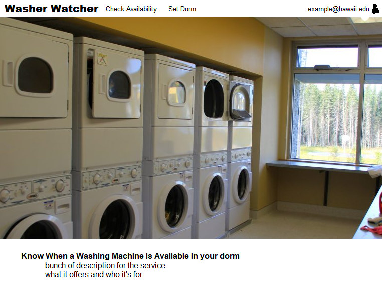
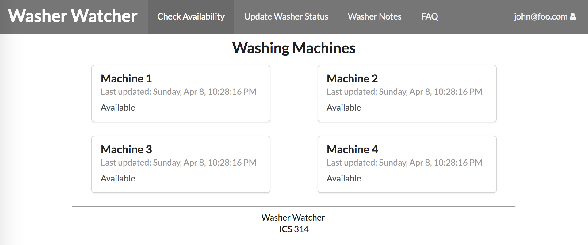
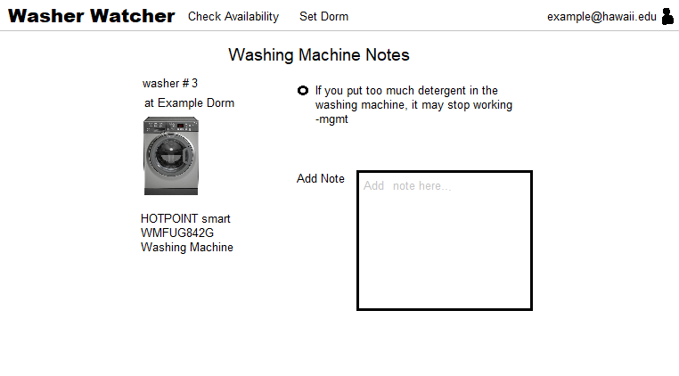
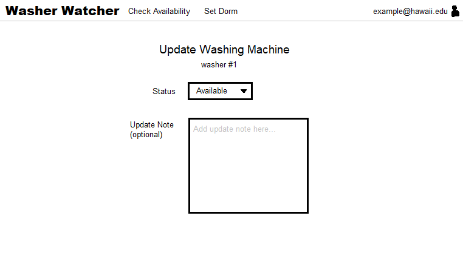
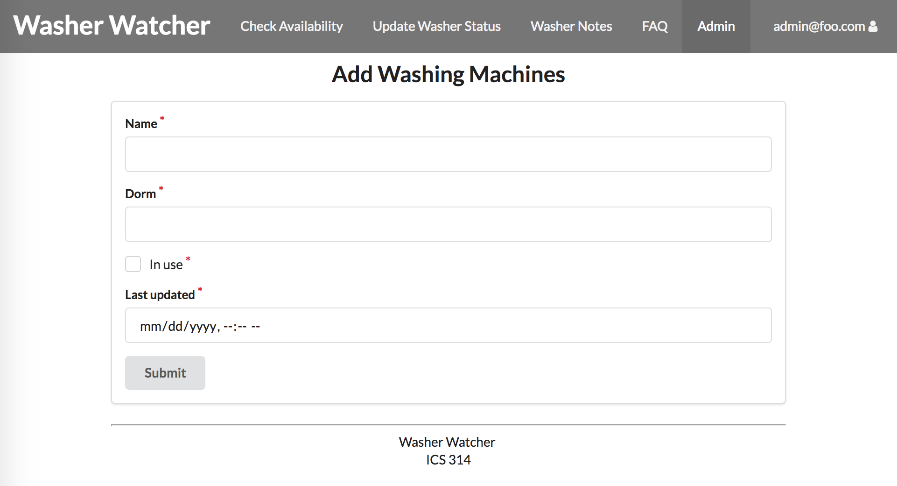
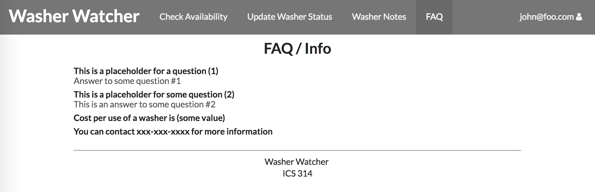

# Table of contents

* [About Washer Watcher](#about-washer-watcher)
* [Mockup](#mockup)
* [Installation](#installation)
* [Design](#design)
* [Development history](#development-history)
* [The Team](#the-team)

# About Washer Watcher
The UH dorms have washers available for the students to use for their needs. However, there isn't any way to see whether or not there's actually any washers available when a student decides to do their laundry. The solution to this problem is Washer Watcher. This application will allow others to provide status updates of the availability of the washers. A timestamp will be provided with each update so a person can gauge the reliability of the information provided. The ultimate goal is to help alleviate the problem where someone goes to do their laundry just to find out that there isn't any available washers!

# Mockup
The page that a user first sees.
[Landing Page](http://washerwatcher.meteorapp.com/#/)

This page shows the availability of the washers associated with each dorm. [Washing Machine Availability Page](http://washerwatcher.meteorapp.com/#/machines)

[]
On this page, a note can be created for a washer. This can be used for other information such as maintenance. [Washing Machine Notes Page](http://washerwatcher.meteorapp.com/#/notes)

This is the main page that a user visits to update the in use or not in use status of a washing machine. [Update Washing Machine Page](http://washerwatcher.meteorapp.com/#/machines)

This page is for administrators of the application to add new washing machines to a dorm. [Add Washing Machine Page](http://washerwatcher.meteorapp.com/#/admin)

Any common questions users might have can be answered in the Frequently Asked Questions page. [Frequently Asked Questions Page](http://washerwatcher.meteorapp.com/#/machines)

# Installation
Placeholder

# Design
Placeholder

# Development History
Placeholder

# The Team
- Jarrin Kasuya
  * Student at University of Hawaii at Manoa, majoring in Information and Computer Science.  
- Jason Kulka  
  * Student at University of Hawaii at Manoa, majoring in Information and Computer Science.  
- Dylan Nakamoto  
  * Student at University of Hawaii at Manoa, majoring in Information and Computer Science.  
