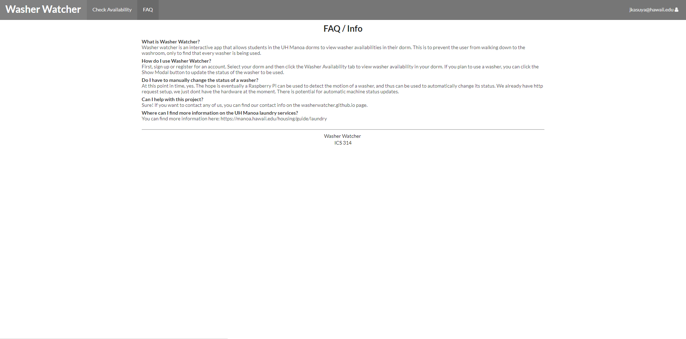

# Table of contents

* [About Washer Watcher](#about-washer-watcher)
* [User Guide](#user-guide)
* [Installation](#installation)
* [Community Feedback](#community-feedback)
* [Development history](#development-history)
* [The Team](#the-team)

# About Washer Watcher
The UH dorms have washers available for the students to use for their needs. However, there isn't any way to see whether or not there's actually any washers available when a student decides to do their laundry. The solution to this problem is [Washer Watcher](http://washerwatcher.meteorapp.com/). This application will allow others to provide status updates of the availability of the washers. A timestamp will be provided with each update so a person can gauge the reliability of the information provided. The ultimate goal is to help alleviate the problem where someone goes to do their laundry just to find out that there isn't any available washers!

# User Guide

The page that a user first sees. It introduces them to the goal of the app, providing them with a spot to log in.
[Landing Page](http://washerwatcher.meteorapp.com/#/)

If a user does not have an account, they can register for one here. On this page, they can choose their dorm, so that only the washers associated with that dorm will be displayed.
[Register Page](http://washerwatcher.meteorapp.com/#/signup)

Should a user move dorms or change dorms every semester, the preferences page allows the user to switch the dorm they are currently seeing.
[User Preferences Page](http://washerwatcher.meteorapp.com/#/preferences)

## Check Availability
This page shows the availability of the washers associated with the current dorm of the user. If the washer are available, then the color will be green. If the washer are in use, the color will be yellow. If the washer is out of order, the color will be red. At the top of the page, there is a counter that notifies the user of how many washers are available in the dorm.
[Washing Machine Availability Page](http://washerwatcher.meteorapp.com/#/machines)

To update the status of the washer, or to add a note to a particular washer, click the Show Modal Button. This is also where the user may view any of the notes for the particular washer.

## Admin Functionality
Admin users view a page similar to the availability page, but have the ability to delete a broken washer, or add a new washer. 
[Admin Add Washer Page (Note: you must be certified as admin to view)](http://washerwatcher.meteorapp.com/#/machines)

Super-Admins can view all accounts and change any user to be an admin. 
[Super-Admin Account Status Page (Note: You must be certified as Super-Admin to view)](http://washerwatcher.meteorapp.com/#/admin)

## FAQ
Any common questions users might have can be answered in the Frequently Asked Questions page. 
[Frequently Asked Questions Page](http://washerwatcher.meteorapp.com/#/faq)

# Community Feedback
Five users were asked to test out this app, one of them being a current member in the UH Manoa dorms. All five users generally gave very positive feedback. They enjoyed how user-friendly the app is, and how user-accomodating the app is. They liked how you can set your dorm and then change your dorm in the preferences page. They found the landing page to be very instructive and well formatted. Finally, users like how timestamped updates and notes are able to be inserted into the app.

The biggest concern of this app is the inability to force users to use the app. All five users expressed concerns that while the app is very easy to use and very easy to learn, a lot of users will not willingly update a washer's status. They want us to find a way to be able to update a washer automatically, through either motion detectors, etc. This can be done with a Raspberry Pi device, and may be implemented in the future.

# Developer Guide
First, install Meteor.

Next, download the latest version of [Washer Watcher](https://github.com/washerwatcher/washerwatcher) to your computer. You can either download it straight from GitHub, or fork it to your account and clone it to your desktop.

cd into the app\ directory of the repository, and then run meteor npm install and meteor npm run start to begin the app.

To reset the data, you may exit meteor, and then run meteor reset.

# Development History
[Milestone 1 (M1)](https://github.com/washerwatcher/washerwatcher/projects/1) 

[Milestone 2 (M2)](https://github.com/washerwatcher/washerwatcher/projects/2)

[Milestone 3 (M3)](https://github.com/washerwatcher/washerwatcher/projects/3)

# The Team
- Jarrin Kasuya
  * Student at University of Hawaii at Manoa, majoring in Information and Computer Science.  
  * jkasuya@hawaii.edu
- Jason Kulka  
  * Student at University of Hawaii at Manoa, majoring in Information and Computer Science. 
  * jkulka@hawaii.edu
- Dylan Nakamoto  
  * Student at University of Hawaii at Manoa, majoring in Information and Computer Science.  
  * dylancn@hawaii.edu
