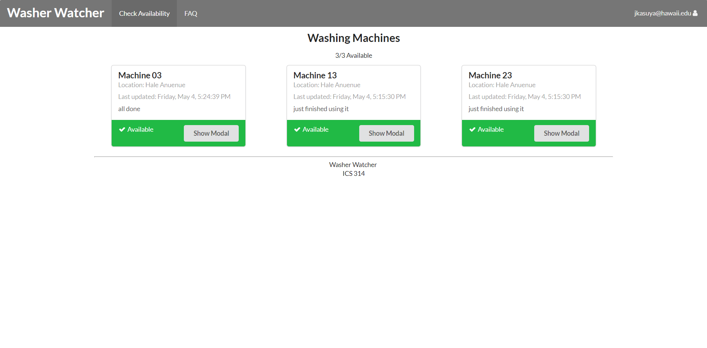

# Table of contents

* [About Washer Watcher](#about-washer-watcher)
* [Mockup](#mockup)
* [Installation](#installation)
* [Design](#design)
* [Development history](#development-history)
* [The Team](#the-team)

# About Washer Watcher
The UH dorms have washers available for the students to use for their needs. However, there isn't any way to see whether or not there's actually any washers available when a student decides to do their laundry. The solution to this problem is [Washer Watcher](http://washerwatcher.meteorapp.com/). This application will allow others to provide status updates of the availability of the washers. A timestamp will be provided with each update so a person can gauge the reliability of the information provided. The ultimate goal is to help alleviate the problem where someone goes to do their laundry just to find out that there isn't any available washers!

# User Guide
The page that a user first sees. It introduces them to the goal of the app, providing them with a spot to log in.
[Landing Page](http://washerwatcher.meteorapp.com/#/)

If a user does not have an account, they can register for one here. On this page, they can choose their dorm, so that only the washers associated with that dorm will be displayed.
[Landing Page](http://washerwatcher.meteorapp.com/#/signup)

This page shows the availability of the washers associated with the current dorm of the user. [Washing Machine Availability Page](http://washerwatcher.meteorapp.com/#/machines)

To update the status of the washer, or to add a note to a particular washer, click the Show Modal Button. [Washing Machine Availability Page](http://washerwatcher.meteorapp.com/#/machines)

Admin users view a page similar to the availability page, but have the ability to delete a broken washer, or add a new washer. [Admin Add Washer Page (Note: you must be certified as admin to view)](http://washerwatcher.meteorapp.com/#/machines)

Super-Admins can view all accounts and change any user to be an admin. [Super-Admin Account Status Page (Note: You must be certified as Super-Admin to view)](http://washerwatcher.meteorapp.com/#/admin)

Any common questions users might have can be answered in the Frequently Asked Questions page. [Frequently Asked Questions Page](http://washerwatcher.meteorapp.com/#/faq)

# Installation
First, install Meteor.

Next, download the latest version of [Washer Watcher](https://github.com/washerwatcher/washerwatcher) to your computer. You can either download it straight from GitHub, or fork it to your account and clone it to your desktop.

cd into the app\ directory of the repository, and then run meteor npm install and meteor npm run start to begin the app.

To reset the data, you may exit meteor, and then run meteor reset

# Testing
Placeholder

# Development History
[Milestone 1 (M1)](https://github.com/washerwatcher/washerwatcher/projects/1) 

[Milestone 2 (M2)](https://github.com/washerwatcher/washerwatcher/projects/2)

# The Team
- Jarrin Kasuya
  * Student at University of Hawaii at Manoa, majoring in Information and Computer Science.  
- Jason Kulka  
  * Student at University of Hawaii at Manoa, majoring in Information and Computer Science.  
- Dylan Nakamoto  
  * Student at University of Hawaii at Manoa, majoring in Information and Computer Science.  
